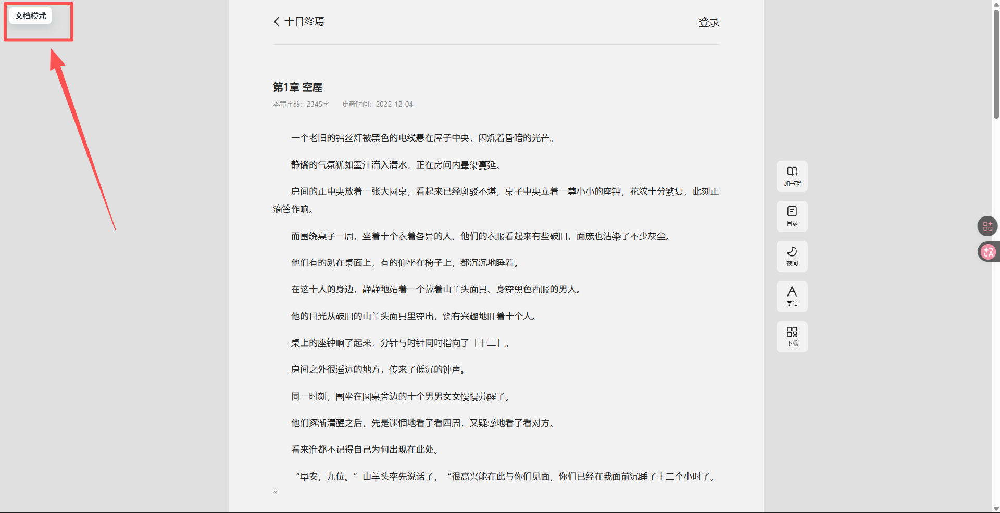
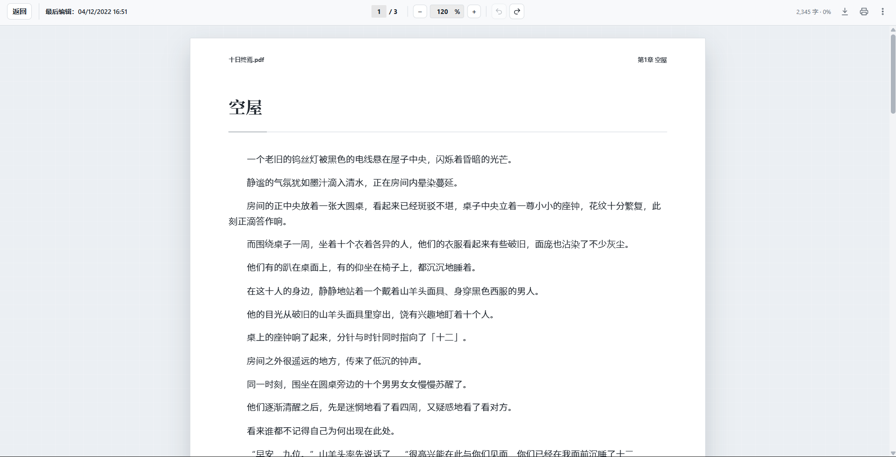
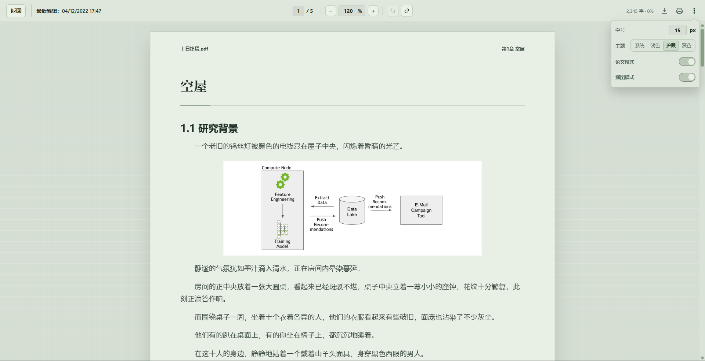
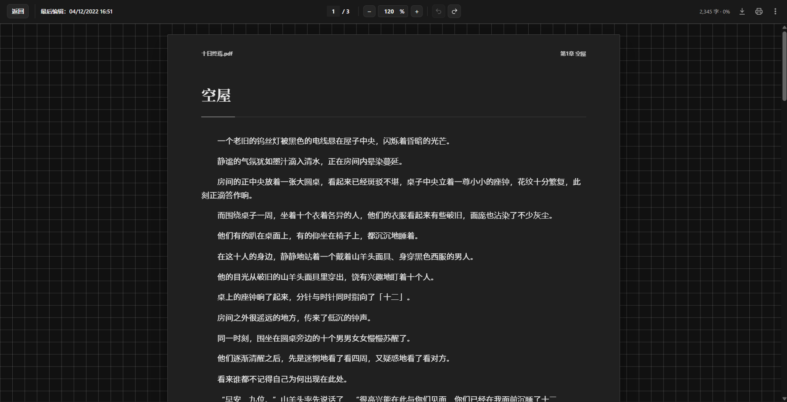
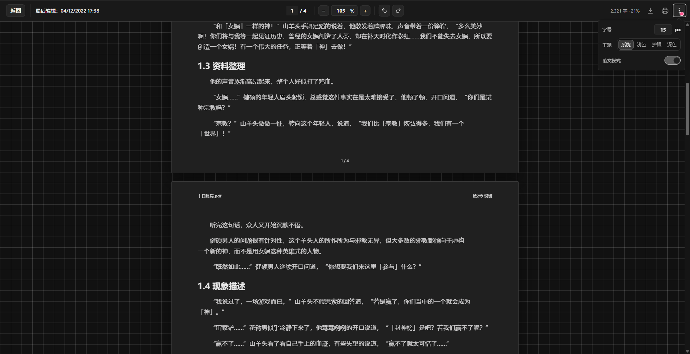

# Fanqie Reader Helper

瀏覽器擴展，用以改善 `fanqienovel.com/reader/*` 的摸魚體驗。

本專案在番茄小說的閱讀頁面上，提供更像pdf文檔閱讀器的版面，包括頁面寬度、縮放、字體大小、行距和主題切換等設定。

## Features

- 在番茄小說閱讀頁面啟用獨立閱讀介面
- 支援字體大小調整
- 支援行距調整（即將支持）
- 支援頁面寬度調整（即將支持）
- 支援頁面縮放調整
- 支援淺色、護眼綠、深色與跟隨系統主題
- 支援手動開啟「論文模式」，在正文中插入泛化論文標題
- 使用瀏覽器本地儲存保存閱讀設定

## Entry Point

After installing the extension, open a Fanqie Novel reader page and click the `文档模式` button in the top-left corner to switch into the document-style reader.



## Screenshots





<!--  -->



## Installation

目前可以用開發者模式手動安裝。

### Chrome / Edge

1. 下載或 clone 這個 repo
2. 打開 Chrome 或 Edge 的擴展管理頁
   - Chrome: `chrome://extensions`
   - Edge: `edge://extensions`
3. 開啟 `Developer mode`
4. 點擊 `Load unpacked`
5. 選擇這個專案資料夾
6. 打開 `https://fanqienovel.com/reader/*` 的閱讀頁面測試

## Package

PowerShell:

```powershell
Compress-Archive -LiteralPath manifest.json,content.js,reader.css -DestinationPath fanqie-reader-helper.zip -Force
```

## Privacy

本擴展只使用 `storage` 權限保存本地閱讀設定，例如字體大小、行距、頁面寬度、縮放比例、主題和論文模式開關。

本擴展不會收集、上傳或分享使用者資料。

## Permissions

- `storage`: 保存閱讀器設定
- `https://fanqienovel.com/reader/*`: 只在番茄小說閱讀頁面注入閱讀器介面

## Disclaimer

This is an unofficial browser extension and is not affiliated with, endorsed by, or sponsored by Fanqie Novel or ByteDance.

本專案是非官方工具，僅用於改善個人閱讀體驗。
